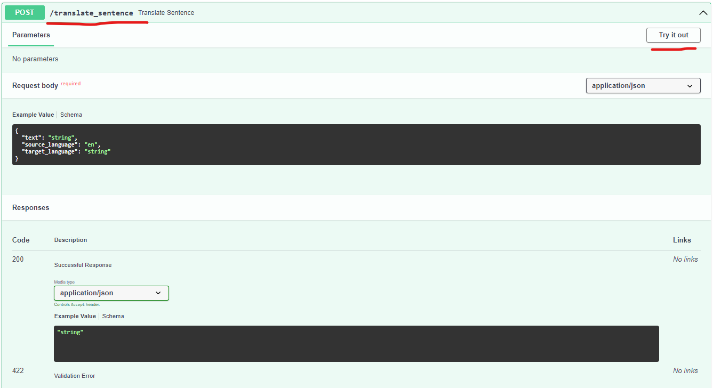
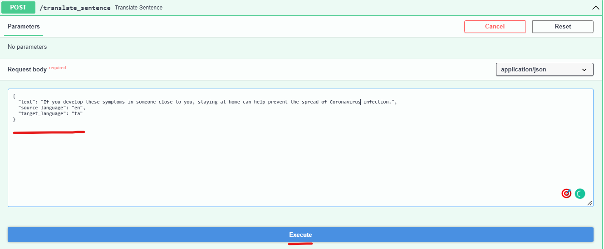
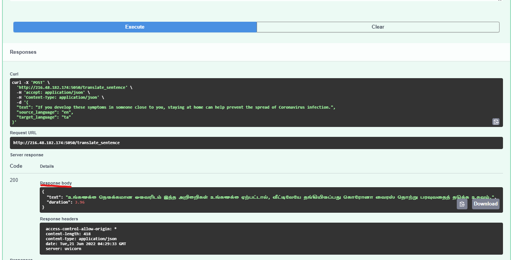
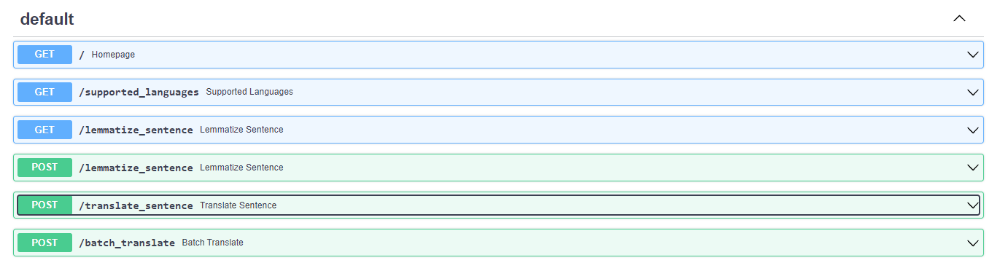

<div align="center">
	<h1><b><i>IndicTrans</i></b></h1>
	<a href="http://indicnlp.ai4bharat.org/samanantar">Website</a> |
	<a href="https://arxiv.org/abs/2104.05596">Paper</a> |
  	<a href="https://youtu.be/QwYPOd1eBtQ?t=383">Video</a> |
	<a href="https://github.com/AI4Bharat/indicTrans/tree/main/AI4B_Demo">Demo Resources</a>
	<br><br>
</div>

🚩**NOTE** 🚩[IndicTrans2](https://github.com/AI4Bharat/IndicTrans2) is now available. It supports 22 Indian languages and has better translation quality compared to IndicTrans1. We recommend using IndicTrans2.

**IndicTrans** is a Transformer-4x ( ~434M ) multilingual NMT model trained on [Samanantar](https://indicnlp.ai4bharat.org/samanantar) dataset which is the largest publicly available parallel corpora collection for Indic languages at the time of writing ( 14 April 2021 ). It is a single script model i.e we convert all the Indic data to the Devanagari script which allows for ***better lexical sharing between languages for transfer learning, prevents fragmentation of the subword vocabulary between Indic languages and allows using a smaller subword vocabulary***. We currently release two models - Indic to English and English to Indic and support the following 11 indic languages:

| <!-- -->      | <!-- -->       | <!-- -->     | <!-- -->    |
| ------------- | -------------- | ------------ | ----------- |
| Assamese (as) | Hindi (hi)     | Marathi (mr) | Tamil (ta)  |
| Bengali (bn)  | Kannada (kn)   | Odia (or)    | Telugu (te) |
| Gujarati (gu) | Malayalam (ml) | Punjabi (pa) |


### Benchmarks

We evaluate IndicTrans model on a [WAT2021](http://lotus.kuee.kyoto-u.ac.jp/WAT/WAT2021/), [WAT2020](https://lotus.kuee.kyoto-u.ac.jp/WAT/WAT2020/), WMT (2014, 2019, 2020), [UFAL](https://ufal.mff.cuni.cz/~ramasamy/parallel/html), [PMI](https://data.statmt.org/pmindia) (subset of the PMIndia dataest created by us for Assamese) and [FLORES](https://github.com/facebookresearch/flores) benchmarks. It outperforms
all publicly available open source models. It also outperforms
commercial systems like Google, Bing translate on most datasets and performs competitively on Flores. Here are the results that we obtain:

<!-- <style type="text/css">
.tg  {border-collapse:collapse;border-spacing:0;}
.tg td{border-color:black;border-style:solid;border-width:1px;font-family:Arial, sans-serif;font-size:14px;
  overflow:hidden;padding:10px 5px;word-break:normal;}
.tg th{border-color:black;border-style:solid;border-width:1px;font-family:Arial, sans-serif;font-size:14px;
  font-weight:normal;overflow:hidden;padding:10px 5px;word-break:normal;}
.tg .tg-9wq8{border-color:inherit;text-align:center;vertical-align:middle}
</style> -->

<table class="tg">
<thead>
  <tr>
    <th class="tg-9wq8"></th>
    <th class="tg-9wq8" colspan="10">WAT2021</th>
    <th class="tg-9wq8" colspan="7">WAT2020</th>
    <th class="tg-9wq8" colspan="3">WMT</th>
    <th class="tg-9wq8">UFAL</th>
    <th class="tg-9wq8">PMI</th>
    <th class="tg-9wq8"  colspan="11">FLORES-101</th>
  </tr>
</thead>
<tbody>
  <tr>
    <td class="tg-9wq8"></td>
    <td class="tg-9wq8">bn</td>
    <td class="tg-9wq8">gu</td>
    <td class="tg-9wq8">hi</td>
    <td class="tg-9wq8">kn</td>
    <td class="tg-9wq8">ml</td>
    <td class="tg-9wq8">mr</td>
    <td class="tg-9wq8">or</td>
    <td class="tg-9wq8">pa</td>
    <td class="tg-9wq8">ta</td>
    <td class="tg-9wq8">te</td>
    <td class="tg-9wq8">bn</td>
    <td class="tg-9wq8">gu</td>
    <td class="tg-9wq8">hi</td>
    <td class="tg-9wq8">ml</td>
    <td class="tg-9wq8">mr</td>
    <td class="tg-9wq8">ta</td>
    <td class="tg-9wq8">te</td>
    <td class="tg-9wq8">hi</td>
    <td class="tg-9wq8">gu</td>
    <td class="tg-9wq8">ta</td>
    <td class="tg-9wq8">ta</td>
    <td class="tg-9wq8">as</td>
    <td class="tg-9wq8">as</td>
    <td class="tg-9wq8">bn</td>
    <td class="tg-9wq8">gu</td>
    <td class="tg-9wq8">hi</td>
    <td class="tg-9wq8">kn</td>
    <td class="tg-9wq8">ml</td>
    <td class="tg-9wq8">mr</td>
    <td class="tg-9wq8">or</td>
    <td class="tg-9wq8">pa</td>
    <td class="tg-9wq8">ta</td>
    <td class="tg-9wq8">te</td>
  </tr>
  <tr>
    <td class="tg-9wq8">IN-EN</td>
    <td class="tg-9wq8">29.6</td>
    <td class="tg-9wq8">40.3</td>
    <td class="tg-9wq8">43.9</td>
    <td class="tg-9wq8">36.4</td>
    <td class="tg-9wq8">34.6</td>
    <td class="tg-9wq8">33.5</td>
    <td class="tg-9wq8">34.4</td>
    <td class="tg-9wq8">43.2</td>
    <td class="tg-9wq8">33.2</td>
    <td class="tg-9wq8">36.2</td>
    <td class="tg-9wq8">20.0</td>
    <td class="tg-9wq8">24.1</td>
    <td class="tg-9wq8">23.6</td>
    <td class="tg-9wq8">20.4</td>
    <td class="tg-9wq8">20.4</td>
    <td class="tg-9wq8">18.3</td>
    <td class="tg-9wq8">18.5</td>
    <td class="tg-9wq8">29.7</td>
    <td class="tg-9wq8">25.1</td>
    <td class="tg-9wq8">24.1</td>
    <td class="tg-9wq8">30.2</td>
    <td class="tg-9wq8">29.9</td>
    <td class="tg-9wq8">23.3</td>
    <td class="tg-9wq8">32.2</td>
    <td class="tg-9wq8">34.3</td>
    <td class="tg-9wq8">37.9</td>
    <td class="tg-9wq8">28.8</td>
    <td class="tg-9wq8">31.7</td>
    <td class="tg-9wq8">30.8</td>
    <td class="tg-9wq8">30.1</td>
    <td class="tg-9wq8">35.8</td>
    <td class="tg-9wq8">28.6</td>
    <td class="tg-9wq8">33.5</td>
  </tr>
  <tr>
    <td class="tg-9wq8">EN-IN</td>
    <td class="tg-9wq8">15.3</td>
    <td class="tg-9wq8">25.6</td>
    <td class="tg-9wq8">38.6</td>
    <td class="tg-9wq8">19.1</td>
    <td class="tg-9wq8">14.7</td>
    <td class="tg-9wq8">20.1</td>
    <td class="tg-9wq8">18.9</td>
    <td class="tg-9wq8">33.1</td>
    <td class="tg-9wq8">13.5</td>
    <td class="tg-9wq8">14.1</td>
    <td class="tg-9wq8">11.4</td>
    <td class="tg-9wq8">15.3</td>
    <td class="tg-9wq8">20.0</td>
    <td class="tg-9wq8">7.2</td>
    <td class="tg-9wq8">12.7</td>
    <td class="tg-9wq8">6.2</td>
    <td class="tg-9wq8">7.6</td>
    <td class="tg-9wq8">25.5</td>
    <td class="tg-9wq8">17.2</td>
    <td class="tg-9wq8">9.9</td>
    <td class="tg-9wq8">10.9</td>
    <td class="tg-9wq8">11.6</td>
    <td class="tg-9wq8">6.9</td>
    <td class="tg-9wq8">20.3</td>
    <td class="tg-9wq8">22.6</td>
    <td class="tg-9wq8">34.5</td>
    <td class="tg-9wq8">18.9</td>
    <td class="tg-9wq8">16.3</td>
    <td class="tg-9wq8">16.1</td>
    <td class="tg-9wq8">13.9</td>
    <td class="tg-9wq8">26.9</td>
    <td class="tg-9wq8">16.3</td>
    <td class="tg-9wq8">22.0</td>
  </tr>
</tbody>
</table>


## Updates
<details><summary>Click to expand </summary>
21 June 2022

```
Add more documentation on hosted API usage
```

18 December 2021

```
Tutorials updated with latest model links
```


26 November 2021
```
 - v0.3 models are now available for download
```

27 June 2021
```
- Updated links for indic to indic model
- Add more comments to training scripts
- Add link to [Samanantar Video](https://youtu.be/QwYPOd1eBtQ?t=383)
- Add folder structure in readme
- Add python wrapper for model inference
```

09 June 2021
```
- Updated links for models
- Added Indic to Indic model
```

09 May 2021
```
- Added fix for finetuning on datasets where some lang pairs are not present. Previously the script assumed the finetuning dataset will have data for all 11 indic lang pairs
- Added colab notebook for finetuning instructions
```
</details>

## Table of contents
- [Updates](#updates)
- [Table of contents](#table-of-contents)
- [Resources](#resources)
  - [Try out model online (Huggingface spaces)](#try-out-model-online-huggingface-spaces)
  - [Download model](#download-model)
  - [Using hosted APIs](#using-hosted-apis)
    - [Sample screenshot of translate_sentence POST request](#sample-screenshot-of-translate_sentence-post-request)
  - [Accessing on ULCA](#accessing-on-ulca)
- [Running Inference](#running-inference)
  - [Command line interface](#command-line-interface)
  - [Python Inference](#python-inference)
- [Training model](#training-model)
  - [Setting up your environment](#setting-up-your-environment)
  - [Details of models and hyperparameters](#details-of-models-and-hyperparameters)
  - [Training procedure and code](#training-procedure-and-code)
  - [WandB plots](#wandb-plots)
  - [Evaluating trained model](#evaluating-trained-model)
  - [Detailed benchmarking results](#detailed-benchmarking-results)
- [Finetuning model on your data](#finetuning-model-on-your-data)
- [License](#license)
- [Contributors](#contributors)
- [Contact](#contact)
- [Acknowledgements](#acknowledgements)

## Resources

### Try out model online (Huggingface spaces)

- [IndicTrans Indic2English](https://huggingface.co/spaces/ai4bharat/IndicTrans-Indic2English)
- [IndicTrans English2Indic](https://huggingface.co/spaces/ai4bharat/IndicTrans-English2Indic)

### Download model

Indic to English: [v0.3](https://ai4b-public-nlu-nlg.objectstore.e2enetworks.net/indic2en.zip)

English to Indic: [v0.3](https://ai4b-public-nlu-nlg.objectstore.e2enetworks.net/en2indic.zip)

Indic to Indic:   [v0.3](https://ai4b-public-nlu-nlg.objectstore.e2enetworks.net/m2m.tar)

[Mirror links](https://indicnlp.ai4bharat.org/indic-trans/#mirror-links) for the IndicTrans models

### STS Benchmark

Download the human annotations for STS benchmark [here](https://objectstore.e2enetworks.net/indic-trans/sts_scores_samanantar.tsv)

### Using hosted APIs

Try out our models at [IndicTrans Demos](https://models.ai4bharat.org/#/nmt)
<!-- <details><summary>Click to expand </summary>

Please visit [API documentation](http://216.48.181.177:5050/docs#) to read more about the available API endpoints/methods you can use.

#### Sample screenshot of translate_sentence POST request

Go to [API documentation](http://216.48.181.177:5050/docs#), scroll to translate_sentence POST request endpoint and click "Try it out" button.

<br>

<p align="left">

</p>

<br>

To try english to tamil translation, set the source language to "en" and target language to "ta" and enter your sentence in the "text" field:

<br>

<p align="left">

</p>

<br>

Check the translation result in response:

<p align="left">

</p>

<br>

Visit the [API documentation](http://216.48.181.177:5050/docs#)to check other supported methods:

<p align="left">

</p>
</details> -->

<br>

Refer to this colab notebook on how to use python to hit the API endpoints--> [](https://colab.research.google.com/github/AI4Bharat/indicTrans/blob/main/indicTrans_hosted_api_inference.ipynb)

### Accessing on ULCA
You can try out our models at [ULCA](https://bhashini.gov.in/ulca/model/explore-models) and filter for IndicTrans models.

## Running Inference
### Command line interface

The model is trained on single sentences and hence, users need to split parapgraphs to sentences before running the translation when using our command line interface (The python interface has `translate_paragraph` method to handle multi sentence translations).

Note: IndicTrans is trained with a max sequence length of **200** tokens (subwords). If your sentence is too long (> 200 tokens), the sentence will be truncated to 200 tokens before translation.

Here is an example snippet to split paragraphs into sentences for English and Indic languages supported by our model:
```python
# install these libraries
# pip install mosestokenizer
# pip install indic-nlp-library

from mosestokenizer import *
from indicnlp.tokenize import sentence_tokenize

INDIC = ["as", "bn", "gu", "hi", "kn", "ml", "mr", "or", "pa", "ta", "te"]

def split_sentences(paragraph, language):
    if language == "en":
        with MosesSentenceSplitter(language) as splitter:
            return splitter([paragraph])
    elif language in INDIC:
        return sentence_tokenize.sentence_split(paragraph, lang=language)

split_sentences("""COVID-19 is caused by infection with the severe acute respiratory
syndrome coronavirus 2 (SARS-CoV-2) virus strain. The disease is mainly transmitted via the respiratory
route when people inhale droplets and particles that infected people release as they breathe, talk, cough, sneeze, or sing. """, language='en')

>> ['COVID-19 is caused by infection with the severe acute respiratory syndrome coronavirus 2 (SARS-CoV-2) virus strain.',
 'The disease is mainly transmitted via the respiratory route when people inhale droplets and particles that infected people release as they breathe, talk, cough, sneeze, or sing.']

split_sentences("""இத்தொற்றுநோய் உலகளாவிய சமூக மற்றும் பொருளாதார சீர்குலைவை ஏற்படுத்தியுள்ளது.இதனால் பெரும் பொருளாதார மந்தநிலைக்குப் பின்னர் உலகளவில் மிகப்பெரிய மந்தநிலை ஏற்பட்டுள்ளது. இது விளையாட்டு,மத, அரசியல் மற்றும் கலாச்சார நிகழ்வுகளை ஒத்திவைக்க அல்லது ரத்து செய்ய வழிவகுத்தது.
அச்சம் காரணமாக முகக்கவசம், கிருமிநாசினி உள்ளிட்ட பொருட்களை அதிக நபர்கள் வாங்கியதால் விநியோகப் பற்றாக்குறை ஏற்பட்டது.""",
 language='ta')

>> ['இத்தொற்றுநோய் உலகளாவிய சமூக மற்றும் பொருளாதார சீர்குலைவை ஏற்படுத்தியுள்ளது.',
 'இதனால் பெரும் பொருளாதார மந்தநிலைக்குப் பின்னர் உலகளவில் மிகப்பெரிய மந்தநிலை ஏற்பட்டுள்ளது.',
 'இது விளையாட்டு,மத, அரசியல் மற்றும் கலாச்சார நிகழ்வுகளை ஒத்திவைக்க அல்லது ரத்து செய்ய வழிவகுத்தது.',
 'அச்சம் காரணமாக முகக்கவசம், கிருமிநாசினி உள்ளிட்ட பொருட்களை அதிக நபர்கள் வாங்கியதால் விநியோகப் பற்றாக்குறை ஏற்பட்டது.']


```

Follow the colab notebook to setup the environment, download the trained _IndicTrans_ models and translating your own text.

Colab notebook for command line inference  --> [](https://colab.research.google.com/github/AI4Bharat/indicTrans/blob/main/indictrans_fairseq_inference.ipynb)

### Python Inference


Colab notebook for python inference       --> [](https://colab.research.google.com/github/AI4Bharat/indicTrans/blob/main/indicTrans_python_interface.ipynb)

 The python interface is useful in case you want to reuse the model for multiple translations and do not want to reinitialize the model each time


 ## Training model
 ###  Setting up your environment
<details><summary>Click to expand </summary>

```bash
cd indicTrans
git clone https://github.com/anoopkunchukuttan/indic_nlp_library.git
git clone https://github.com/anoopkunchukuttan/indic_nlp_resources.git
git clone https://github.com/rsennrich/subword-nmt.git
# install required libraries
pip install sacremoses pandas mock sacrebleu tensorboardX pyarrow indic-nlp-library

# Install fairseq from source
git clone https://github.com/pytorch/fairseq.git
cd fairseq
pip install --editable ./

```
</details>

### Details of models and hyperparameters

- Architechture: IndicTrans uses 6 encoder and decoder layers, input embeddings of size 1536 with 16 attention heads and
feedforward dimension of 4096 with total number of parameters of 434M
- Loss: Cross entropy loss
- Optimizer: Adam
- Label Smoothing: 0.1
- Gradient clipping: 1.0
- Learning rate: 5e-4
- Warmup_steps: 4000

Please refer to section 4, 5 of our [paper](https://arxiv.org/ftp/arxiv/papers/2104/2104.05596.pdf) for more details on training/experimental setup.

### Training procedure and code

The high level steps we follow for training are as follows:


Organize the traning data as en-X folders where each folder has two text files containing parallel data for en-X lang pair.
```bash

# final_data
# ├── en-as
# │   ├── train.as
# │   └── train.en
# ├── en-bn
# │   ├── train.bn
# │   └── train.en
# ├── en-gu
# │   ├── train.en
# │   └── train.gu
# ├── en-hi
# │   ├── train.en
# │   └── train.hi
# ├── en-kn
# │   ├── train.en
# │   └── train.kn
# ├── ....
```

Organize the developement set and test set of multiple benchmarks as follows:

```bash

<all devtest dir>
├──<benchmark 1>
|    ├── en-as
|    ├── en-bn
|    ├── en-gu
|    └── en-hi
|        ├── test.en
|        ├── test.en
|        ├── dev.en
|        └── dev.hi
├──<benchmark 2>
|
...
```

Removing dev and test set overlaps from training data
Refer to "Training Data" subsection in section 4 of our [paper](https://arxiv.org/ftp/arxiv/papers/2104/2104.05596.pdf) for more details on how we use a strict overlap removal method.

```bash
python3 remove_train_devtest_overlaps.py <train_data_dir> <all devtest dir>
^ if you are only training for en-x

python3 remove_train_devtest_overlaps.py <train_data_dir> <all devtest dir> true
^ if you are training many2many model
```

Prepare the experiment folder and create the binarized data required for fairseq

```bash
<exp dir>             # named like indic-en-exp for indic-en training or en-indic-exp for en-indic training
├──<devtest>
    └── all
        ├── en-as
            ├── dev.en      # merge all en files for en-as dev sets
            ├── dev.as      # merge all as files for en-as dev sets
            ├── test.en     # merge all en files for en-as test sets
            └── test.as     # merge all as files for en-as test sets
        ├── en-bn
        ├── en-gu
        ├── ...
        └── en-hi
   ├── en-as
   ├── en-bn
   ├── ...
   └── en-te
        ├── train.en      # merged en train set for en-te with all devtest overlaps removed
        └── train.te      # merged te train set for en-te with all devtest overlaps removed

# Using exp dir, prepare the training data as required for Fairseq using prepare_data_joint_training.sh

# prepare_data_joint_training.sh takes exp dir, src_lang, tgt_lang as input
# This does preprocessing, building vocab, binarization for joint training

# Creating the vocabulary will take a while if the dataset is huge. To make it faster, run it on a multicore system
bash prepare_data_joint_training.sh '../indic-en-exp' 'indic' 'en'
```

 Start training with fairseq-train command. Please refer to [fairseq documentaion](https://fairseq.readthedocs.io/en/latest/command_line_tools.html) to know more about each of these options
```bash


# some notable args:
# --max-updates         -> maximum update steps the model will be trained for
# --arch=transformer_4x -> we use a custom transformer model and name it transformer_4x (4 times the parameter size of transformer  base)
# --user_dir            -> we define the custom transformer arch in model_configs folder and pass it as an argument to user_dir for fairseq to register this architechture
# --lr                  -> learning rate. From our limited experiments, we find that lower learning rates like 3e-5 works best for finetuning.
# --max_tokens          -> this is max tokens per batch. You should limit to lower values if you get oom errors.
# --update-freq         -> gradient accumulation steps

fairseq-train ../indic-en-exp/final_bin \
--max-source-positions=210 \
--max-target-positions=210 \
--max-update=<max_updates> \
--save-interval=1 \
--arch=transformer_4x \
--criterion=label_smoothed_cross_entropy \
--source-lang=SRC \
--lr-scheduler=inverse_sqrt \
--target-lang=TGT \
--label-smoothing=0.1 \
--optimizer adam \
--adam-betas "(0.9, 0.98)" \
--clip-norm 1.0 \
--warmup-init-lr 1e-07 \
--lr 0.0005 \
--warmup-updates 4000 \
--dropout 0.2 \
--save-dir ../indic-en-exp/model \
--keep-last-epochs 5 \
--patience 5 \
--skip-invalid-size-inputs-valid-test \
--fp16 \
--user-dir model_configs \
--wandb-project <wandb_project_name> \
--update-freq=<grad_accumulation_steps> \
--distributed-world-size <num_gpus> \
--max-tokens <max_tokens_in_a_batch>

```

The above steps are further documented in our colab notebook

[](https://colab.research.google.com/github/AI4Bharat/indicTrans/blob/main/IndicTrans_training.ipynb)


Please refer to this [issue](https://github.com/AI4Bharat/indicTrans/issues/23) to see discussion of our training hyperparameters.

### WandB plots

[IndicTrans en-indic model](https://wandb.ai/ai4b-anuvaad/indictrans4x-en-indic)

[IndicTrans indic-en model](https://wandb.ai/ai4b-anuvaad/indictrans4x-indic-en)

### Evaluating trained model

The trained model will get saved in the experiment directory. It will have the following files:

```bash

 en-indic/                              # en to indic experiment directory
 ├── final_bin                          # contains fairseq dictionaries
 │   ├── dict.SRC.txt
 │   └── dict.TGT.txt
 ├── model                              # contains model checkpoint(s)
 │   └── checkpoint_best.pt
 └── vocab                              # contains bpes for src and tgt (since we train seperate vocabularies) generated with subword_nmt
     ├── bpe_codes.32k.SRC
     ├── bpe_codes.32k.TGT
     ├── vocab.SRC
     └── vocab.TGT
```

To test the models after training, you can use `joint_translate.sh` to get output predictions and `compute_bleu.sh` to compute bleu scores.

```bash


# joint_translate takes src_file, output_fname, src_lang, tgt_lang, model_folder as inputs
# src_file -> input text file to be translated
# output_fname -> name of the output file (will get created) containing the model predictions
# src_lang -> source lang code of the input text ( in this case we are using en-indic model and hence src_lang would be 'en')
# tgt_lang -> target lang code of the input text ( tgt lang for en-indic model would be any of the 11 indic langs we trained on:
#              as, bn, hi, gu, kn, ml, mr, or, pa, ta, te)
# supported languages are:
#              as - assamese, bn - bengali, gu - gujarathi, hi - hindi, kn - kannada,
#              ml - malayalam, mr - marathi, or - oriya, pa - punjabi, ta - tamil, te - telugu

# model_folder -> the directory containing the model and the vocab files ( the model is stored in exp_dir/model)


# here we are translating the english sentences to hindi and model_folder contains the model checkpoint
bash joint_translate.sh <path to test.en> en_hi_outputs.txt 'en' 'hi' model_folder

# to compute bleu scores for the predicitions with a reference file, use the following command
# arguments:
# pred_fname: file that contains model predictions
# ref_fname: file that contains references
# src_lang and tgt_lang : the source and target language

bash compute_bleu.sh en_hi_outputs.txt <path to test.hi reference file> 'en' 'hi'

```

### Detailed benchmarking results

Refer to [Benchmarks](#benchmarks) for results of IndicTrans model on various benchmarks.
Please refer to table 6,7 of our [paper](https://arxiv.org/ftp/arxiv/papers/2104/2104.05596.pdf) for comparison with other open source and commercial models and section 6 for detailed discussion of the results


 ## Finetuning model on your data

The high level steps for finetuning on your own dataset are:

Organize the traning data as en-X folders where each folder has two text files containing parallel data for en-X lang pair.
```bash
# final_data
# ├── en-as
# │   ├── train.as
# │   └── train.en
# ├── en-bn
# │   ├── train.bn
# │   └── train.en
# ├── en-gu
# │   ├── train.en
# │   └── train.gu
# ├── en-hi
# │   ├── train.en
# │   └── train.hi
# ├── en-kn
# │   ├── train.en
# │   └── train.kn
# ├── ....

```
Organize the developement set and test set of multiple benchmarks as follows:
```bash
<all devtest dir>
├──<benchmark 1>
|    ├── en-as
|    ├── en-bn
|    ├── en-gu
|    └── en-hi
|        ├── test.en
|        ├── test.en
|        ├── dev.en
|        └── dev.hi
├──<benchmark 2>
|
...
```

Removing dev and test set overlaps from training data
Refer to "Training Data" subsection in section 4 of our [paper](https://arxiv.org/ftp/arxiv/papers/2104/2104.05596.pdf) for more details on how we use a strict overlap removal method.
```bash
python3 remove_train_devtest_overlaps.py <train_data_dir> <all devtest dir>
^ if you are only training for en-x

python3 remove_train_devtest_overlaps.py <train_data_dir> <all devtest dir> true
^ if you are training many2many model
```
After removing the dev and test set overlaps, you can move the train files and benchmark files (refer to colab notebook below for more details) to the experiment directory. This will have the trained checkpoint and the following structure:
```bash
# prepare the experiment folder

 <exp dir>                              # experiment directory
 ├── final_bin                          # contains fairseq dictionaries which we will use to binarize the new finetuning data
 │   ├── dict.SRC.txt
 │   └── dict.TGT.txt
 ├── model                              # contains model checkpoint(s)
 │   └── checkpoint_best.pt
 └── vocab                              # contains bpes for src and tgt (since we train seperate vocabularies) generated with subword_nmt
     ├── bpe_codes.32k.SRC
     ├── bpe_codes.32k.TGT
     ├── vocab.SRC
     └── vocab.TGT

# We will use fairseq-train to finetune the model:


# some notable args:
# --max-update=1000     -> for this example, to demonstrate how to finetune we are only training for 1000 steps. You should increase this when finetuning
# --arch=transformer_4x -> we use a custom transformer model and name it transformer_4x (4 times the parameter size of transformer  base)
# --user_dir            -> we define the custom transformer arch in model_configs folder and pass it as an argument to user_dir for fairseq to register this architechture
# --lr                  -> learning rate. From our limited experiments, we find that lower learning rates like 3e-5 works best for finetuning.
# --restore-file        -> reload the pretrained checkpoint and start training from here (change this path for indic-en. Currently its is set to en-indic)
# --reset-*             -> reset and not use lr scheduler, dataloader, optimizer etc of the older checkpoint
# --max_tokns           -> this is max tokens per batch


fairseq-train <exp_dir>/final_bin \
--max-source-positions=210 \
--max-target-positions=210 \
--max-update=1000 \
--save-interval=1 \
--arch=transformer_4x \
--criterion=label_smoothed_cross_entropy \
--source-lang=SRC \
--lr-scheduler=inverse_sqrt \
--target-lang=TGT \
--label-smoothing=0.1 \
--optimizer adam \
--adam-betas "(0.9, 0.98)" \
--clip-norm 1.0 \
--warmup-init-lr 1e-07 \
--warmup-updates 4000 \
--dropout 0.2 \
--tensorboard-logdir <exp_dir>/tensorboard-wandb \
--save-dir <exp_dir>/model \
--keep-last-epochs 5 \
--patience 5 \
--skip-invalid-size-inputs-valid-test \
--fp16 \
--user-dir model_configs \
--update-freq=2 \
--distributed-world-size 1 \
--max-tokens 256 \
--lr 3e-5 \
--restore-file <checkpoint exp_dir>/model/checkpoint_best.pt \
--reset-lr-scheduler \
--reset-meters \
--reset-dataloader \
--reset-optimizer
```


The above steps (setup the environment, download the trained _IndicTrans_ models and prepare your custom dataset for funetuning) are further documented in our colab notebook
[](https://colab.research.google.com/github/AI4Bharat/indicTrans/blob/main/indicTrans_Finetuning.ipynb)


Please refer to this [issue](https://github.com/AI4Bharat/indicTrans/issues/9) for some tips on finetuning.

**Note**: Since this is a big model (400M params), you might not be able to train with reasonable batch sizes in the free google Colab account. We are planning to release smaller models (after pruning / distallation) soon.

<!-- ## Mining Indic to Indic pairs from english centric corpus

The `extract_non_english_pairs` in `scripts/extract_non_english_pairs.py` can be used to mine indic to indic pairs from english centric corpus.

As described in the [paper](https://arxiv.org/ftp/arxiv/papers/2104/2104.05596.pdf) (section 2.5) , we use a very strict deduplication criterion to avoid the creation of very similar parallel sentences. For example, if an en sentence is aligned to *M* hi sentences and *N* ta sentences, then we would get *MN* hi-ta pairs. However, these pairs would be very similar and not contribute much to the training process. Hence, we retain only 1 randomly chosen pair out of these *MN* pairs.

```bash
extract_non_english_pairs(indir, outdir, LANGS):
    """
    Extracts non-english pair parallel corpora
    indir: contains english centric data in the following form:
            - directory named en-xx for language xx
            - each directory contains a train.en and train.xx
    outdir: output directory to store mined data for each pair.
            One directory is created for each pair.
    LANGS: list of languages in the corpus (other than English).
            The language codes must correspond to the ones used in the
            files and directories in indir. Prefarably, sort the languages
            in this list in alphabetic order. outdir will contain data for xx-yy,
            but not for yy-xx, so it will be convenient to have this list in sorted order.
    """
``` -->

## Folder Structure
```

IndicTrans
│   .gitignore
│   apply_bpe_traindevtest_notag.sh         # apply bpe for joint vocab (Train, dev and test)
│   apply_single_bpe_traindevtest_notag.sh  # apply bpe for seperate vocab   (Train, dev and test)
│   binarize_training_exp.sh                # binarize the training data after preprocessing for fairseq-training
│   compute_bleu.sh                         # Compute blue scores with postprocessing after translating with `joint_translate.sh`
│   indictrans_fairseq_inference.ipynb      # colab example to show how to use model for inference
│   indicTrans_Finetuning.ipynb             # colab example to show how to use model for finetuning on custom domain data
│   joint_translate.sh                      # used for inference (see colab inference notebook for more details on usage)
│   learn_bpe.sh                            # learning joint bpe on preprocessed text
│   learn_single_bpe.sh                     # learning seperate bpe on preprocessed text
│   LICENSE
│   prepare_data.sh                         # prepare data given an experiment dir (this does preprocessing,
│                                           # building vocab, binarization ) for bilingual training
│   prepare_data_joint_training.sh          # prepare data given an experiment dir (this does preprocessing,
│                                           # building vocab, binarization ) for joint training
│   README.md
│
├───legacy                                  # old unused scripts
├───model_configs                           # custom model configrations are stored here
│       custom_transformer.py               # contains custom 4x transformer models
│       __init__.py
├───inference
│       custom_interactive.py               # for python wrapper around fairseq-interactive
│       engine.py                           # python interface for model inference
└───scripts                                 # stores python scripts that are used by other bash scripts
    │   add_joint_tags_translate.py         # add lang tags to the processed training data for bilingual training
    │   add_tags_translate.py               # add lang tags to the processed training data for joint training
    │   clean_vocab.py                      # clean vocabulary after building with subword_nmt
    │   concat_joint_data.py                # concatenates lang pair data and creates text files to keep track
    │                                       # of number of lines in each lang pair.
    │   extract_non_english_pairs.py        # Mining Indic to Indic pairs from english centric corpus
    │   postprocess_translate.py            # Postprocesses translations
    │   preprocess_translate.py             # Preprocess translations and for script conversion (from indic to devnagiri)
    │   remove_large_sentences.py           # to remove large sentences from training data
    └───remove_train_devtest_overlaps.py    # Finds and removes overlaped data of train with dev and test sets
```


## Citing our work

If you are using any of the resources, please cite the following article:
```
@article{10.1162/tacl_a_00452,
    author = {Ramesh, Gowtham and Doddapaneni, Sumanth and Bheemaraj, Aravinth and Jobanputra, Mayank and AK, Raghavan and Sharma, Ajitesh and Sahoo, Sujit and Diddee, Harshita and J, Mahalakshmi and Kakwani, Divyanshu and Kumar, Navneet and Pradeep, Aswin and Nagaraj, Srihari and Deepak, Kumar and Raghavan, Vivek and Kunchukuttan, Anoop and Kumar, Pratyush and Khapra, Mitesh Shantadevi},
    title = "{Samanantar: The Largest Publicly Available Parallel Corpora Collection for 11 Indic Languages}",
    journal = {Transactions of the Association for Computational Linguistics},
    volume = {10},
    pages = {145-162},
    year = {2022},
    month = {02},
    abstract = "{We present Samanantar, the largest publicly available parallel corpora collection for Indic languages. The collection contains a total of 49.7 million sentence pairs between English and 11 Indic languages (from two language families). Specifically, we compile 12.4 million sentence pairs from existing, publicly available parallel corpora, and additionally mine 37.4 million sentence pairs from the Web, resulting in a 4× increase. We mine the parallel sentences from the Web by combining many corpora, tools, and methods: (a) Web-crawled monolingual corpora, (b) document OCR for extracting sentences from scanned documents, (c) multilingual representation models for aligning sentences, and (d) approximate nearest neighbor search for searching in a large collection of sentences. Human evaluation of samples from the newly mined corpora validate the high quality of the parallel sentences across 11 languages. Further, we extract 83.4 million sentence
                    pairs between all 55 Indic language pairs from the English-centric parallel corpus using English as the pivot language. We trained multilingual NMT models spanning all these languages on Samanantar which outperform existing models and baselines on publicly available benchmarks, such as FLORES, establishing the utility of Samanantar. Our data and models are available publicly at Samanantar and we hope they will help advance research in NMT and multilingual NLP for Indic languages.}",
    issn = {2307-387X},
    doi = {10.1162/tacl_a_00452},
    url = {https://doi.org/10.1162/tacl\_a\_00452},
    eprint = {https://direct.mit.edu/tacl/article-pdf/doi/10.1162/tacl\_a\_00452/1987010/tacl\_a\_00452.pdf},
}
```

We would like to hear from you if:

- You are using our resources. Please let us know how you are putting these resources to use.
- You have any feedback on these resources.


## License

The IndicTrans code (and models) are released under the MIT License.


## Contributors

- Gowtham Ramesh, <sub>([RBCDSAI](https://rbcdsai.iitm.ac.in), [IITM](https://www.iitm.ac.in))</sub>
- Sumanth Doddapaneni, <sub>([RBCDSAI](https://rbcdsai.iitm.ac.in), [IITM](https://www.iitm.ac.in))</sub>
- Aravinth Bheemaraj, <sub>([Tarento](https://www.linkedin.com/company/tarento-group/), [EkStep](https://ekstep.in))</sub>
- Mayank Jobanputra, <sub>([IITM](https://www.iitm.ac.in))</sub>
- Raghavan AK, <sub>([AI4Bharat](https://ai4bharat.org))</sub>
- Ajitesh Sharma, <sub>([Tarento](https://www.linkedin.com/company/tarento-group/), [EkStep](https://ekstep.in))</sub>
- Sujit Sahoo, <sub>([Tarento](https://www.linkedin.com/company/tarento-group/), [EkStep](https://ekstep.in))</sub>
- Harshita Diddee, <sub>([AI4Bharat](https://ai4bharat.org))</sub>
- Mahalakshmi J, <sub>([AI4Bharat](https://ai4bharat.org))</sub>
- Divyanshu Kakwani, <sub>([IITM](https://www.iitm.ac.in), [AI4Bharat](https://ai4bharat.org))</sub>
- Navneet Kumar, <sub>([Tarento](https://www.linkedin.com/company/tarento-group/), [EkStep](https://ekstep.in))</sub>
- Aswin Pradeep, <sub>([Tarento](https://www.linkedin.com/company/tarento-group/), [EkStep](https://ekstep.in))</sub>
- Srihari, Nagaraj, <sub>([Tarento](https://www.linkedin.com/company/tarento-group/), [EkStep](https://ekstep.in))</sub>
- Kumar Deepak, <sub>([Tarento](https://www.linkedin.com/company/tarento-group/), [EkStep](https://ekstep.in))</sub>
- Vivek Raghavan, <sub>([EkStep](https://ekstep.in))</sub>
- Anoop Kunchukuttan, <sub>([Microsoft](https://www.microsoft.com/en-in/), [AI4Bharat](https://ai4bharat.org))</sub>
- Pratyush Kumar, <sub>([RBCDSAI](https://rbcdsai.iitm.ac.in), [AI4Bharat](https://ai4bharat.org), [IITM](https://www.iitm.ac.in))</sub>
- Mitesh Shantadevi Khapra, <sub>([RBCDSAI](https://rbcdsai.iitm.ac.in), [AI4Bharat](https://ai4bharat.org), [IITM](https://www.iitm.ac.in))</sub>


## Contact

- Anoop Kunchukuttan ([anoop.kunchukuttan@gmail.com](mailto:anoop.kunchukuttan@gmail.com))
- Mitesh Khapra ([miteshk@cse.iitm.ac.in](mailto:miteshk@cse.iitm.ac.in))
- Pratyush Kumar ([pratyush@cse.iitm.ac.in](mailto:pratyush@cse.iitm.ac.in))


## Acknowledgements

We would like to thank EkStep Foundation for their generous grant which helped in setting up the Centre for AI4Bharat at IIT Madras to support our students, research staff, data and computational requirements. We would like to thank The Ministry of Electronics and Information Technology (NLTM) for its grant to support the creation of datasets and models for Indian languages under its ambitions Bhashini project. We would also like to thank the Centre for Development of Advanced Computing, India (C-DAC) for providing access to the Param Siddhi supercomputer for training our models. Lastly, we would like to thank Microsoft for its grant to create datasets, tools and resources for Indian languages.
